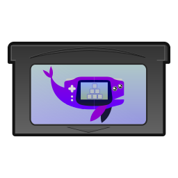
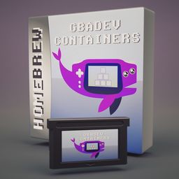

# gbadev-containers

Container scripts for a GBA dev environment & ROM compile workflow.

 

Powered by [OCI containers](https://opencontainers.org/) to create immutable build environments, via [podman](https://podman.io/) or [docker](https://www.docker.com/).

Created for [GBA Jam 2024](https://itch.io/jam/gbajam24).

ROM also hosted at [https://breadmakesyoufull.itch.io/gbadev-containers](https://breadmakesyoufull.itch.io/gbadev-containers)

[View this README in gba manual pdf format here.](./manual.pdf)

by BreadMakesYouFull

## Preview

 

## Requires

* podman OR docker (``make BUILDER=docker``)
* bash
* make

[podman can be installed on linux, windows and mac](https://podman.io/docs/installation).

## Provides

Container images created by this project:

* gbadev-base: debian + devkitproARM + gba development packages
* gbadev: Used to compile the ``in`` folder via butano and devkitproARM
* gbadev-examples: Compiled gba examples from butano / natu

Installed packages include:

* [butano](https://gvaliente.github.io/butano/) - C++ gba game engine, used to create gbadev-containers.gba 
* [devkitPro (ARM / gba)](https://devkitpro.org/wiki/Getting_Started) - build toolchain, used to compile gbadev-containers.gba
* [natu](https://natu.exelo.tl/) - nim gba toolkit
* [mgba](https://mgba.io/) - gba emulator
* [debian](https://www.debian.org/) - userspace tools and packages
* [doxygen](https://www.doxygen.nl/) - code documentation
* [cpplint](https://github.com/cpplint/cpplint) - c++ linting
* [clang-{tidy,format}](https://clang.llvm.org/) - auto lint/format
* [slate](https://github.com/mitchcurtis/slate)  - pixel editor (bmp files must be post processed for butano)
* [gimp 2.0 - image editor](https://www.gimp.org/)
* experimental gimp to butano export plugin - created by me

## Quickstart

```
# Build the gbadev-base container, compile the demo ROM, and run:
make && make run

# See available commands:
make help

# Package versions configured via the ``env`` file
# Regenerate base gbadev container image via:
make base

# Run the example games from butano and natu:
make examples && make run-examples
```

## Licenses

I am not a lawyer, this is not legal advice

**DO NOT** distribute container images you build with this project. Do not upload them to docker.io or similar services. To understand why, [read this report by the linux foundation](https://www.linuxfoundation.org/resources/publications/docker-containers-what-are-the-open-source-licensing-considerations).

* **ONLY** source code of this project, the demo example (``in`` folder) and the included ROM file is covered by the ``LICENSE`` file and ``licenses`` folder. NOT created container images, NOT all assets. 
* The container scripts (often referred to as Dockerfiles) themselves **ARE** included in this, but **NOT** resulting container images you build.
* basic-studio.blend by FnaX https://blendswap.com/blend/30270 CC-0 “No Rights Reserved” https://creativecommons.org/public-domain/cc0/
* Gameboy Advance Cartridge (GBA Cart) STL by @Dave https://www.printables.com/model/190861-gameboy-advance-cartridge-gba-cart/files CC BY 4.0 - Share / Adapt by attribution https://creativecommons.org/licenses/by/4.0/
* GBA Jam Logos and banners made by GBA Jam 2024 Organizers, licensed under [CC BY-NC 4.0](https://creativecommons.org/licenses/by-nc/4.0/)
* "JAM 2024" logo text font — Over Drive by [Graphic Arts Unit](https://www.graphicartsunit.com/gaupra/index.html)
* [Font besciii](https://github.com/damianvila/font-bescii) (Damian Vila) [CC0 1.0 Universal license](https://creativecommons.org/publicdomain/zero/1.0/)
* Other assets BreadMakesYouFull CC BY 4.0 https://creativecommons.org/licenses/by/4.0/deed.en
* The project itself was created **FOR**, but **NOT BY** GBA Jam 2024 / gbadev.net
* This project is **NOT** affiliated with Nintendo in any way.

If you understand and meet these obligations, this project may be used to build your own GBA homebrew ROM, be it for fun and or profit. Consider making your homebrew open source, and giving credit if you found this useful.

## Project structure

```
.
├── gbadev-containers.gba  - Pre-built ROM
├── containers/ - Container build instructions
├── scripts/    - Bash scripts and utilities
├── env         - Build options
├── Makefile    - Entry point for builds
├── in          - gbadev-containers.gba source code
├── out         - ROM build output location
├── LICENSE     - License for this project
├── licenses    - Third party licenses
└── README.md   - Essential info
```

The ``in`` folder contains source for a homebrew demo, which makes use of the "butano" game engine.

The container images created by the ``Containerfile`` scripts are ``gbadev-base`` and ``gbadev``. Which provide tools for development and run a ROM build respectively.

The resulting  ``.gba`` ROM file is compiled to the ``out`` folder.

## Use cases

### Use case 1: Using this project as a template for your homebrew

Simply build from the existing example, the ``in`` folder, and play with iterative changes!

You must comply with ``LICENSE`` and **ALL** of the ``licenses``  folder.

### Use case 2: Build an existing project

Here is an example of building the homebrew game, "sips", by Jono Shields (foopod). It was also written utilizing the butano game engine (by GValiente), so can easily be built using this project's set up:

```
# Clone the source for the game "sips"
git clone https://github.com/foopod/sips.git

# Tweak the game's makefile to point to the container image butano location
sed -i 's|LIBBUTANO   :=.*|LIBBUTANO=/opt/butano/butano|' ./sips/Makefile

# Enter the container build repo
cd gbadev-containers

# Configure butano version to when the game source code was written
sed -i 's/BUTANO=.*/BUTANO=16.2.0/' env

# Build the base dev environment with the butano version configured in the last step
make base

# Run build for the sips source code
make IN=`pwd`/../sips
```

### Use case 3: Cross platform development

[podman can be installed on linux, windows and mac](https://podman.io/docs/installation).

On linux cross distribution support is simplified further via distrobox. This allows for things like launching mgba without complex socket configuration:

```
# Make gbadev-base podman container
make base
# Convert container to distrobox
distrobox-create --name gbadev-distrobox --image gbadev-base
# Enter distrobox
distrobox-enter gbadev-distrobox
# Run mgba GUI
distrobox-enter gbadev-distrobox
```

## Drawbacks

This workflow may not be for you! There are a number of drawbacks to this approach including:

* bloat -> Remove what you don't need?
* time -> Build the base image only once?
* overhead -> Just install and run bare metal instead?
* maintenance -> Clean up old image builds?
* Licenses -> Read [licenses](#licenses)
* C++ -> try natu / nim instead?
* Old versions -> Nixos/Nixpkgs/Guix? Different base image? Pacman/AUR? 
* Learning curve -> Run ``make`` -> look in ``out`` for your ROM :)

## Additional information

For reference this repo was created with:

```
$ podman -v ; docker -v ;  uname -srm ; bash --version ; make --version
podman version 3.4.4
Docker version 27.0.3, build 7d4bcd8
Linux 6.9.3 x86_64
GNU bash, version 5.1.16
GNU Make 4.3
```

Depending on hardware and project you will require:

* ~10GiB disk space
* ~15 mins for initial build
* ~1 min for any subsequent builds

# Thanks

A special thanks to the GBA Jam 2024 hosts - [exelotl](https://exelotl.itch.io), [destoer](https://destoer.itch.io), [evanbowman](https://evanbowman.itch.io), [Nikku4211](https://nikku4211.itch.io), [Pyro_Pyro](https://pyro-pyro.itch.io), [Jono Shields](https://foopod.itch.io), [GValiente](https://gvaliente.itch.io), [Xilefian](https://xilefian.itch.io), [kva64](https://kva64.itch.io), [avivace](https://avivace.itch.io) 

In particular GValiente for the Butano game engine and the thorough documentation.

Made possible by the open source and GBA homebrew development communities:
 
* [GBA Jam 2024](https://itch.io/jam/gbajam24)
* [gbadev.net](https://gbadev.net/resources.html#articles)
* [Butano](https://github.com/GValiente/butano)
* [natu](https://natu.exelo.tl/index.html)
* [Devkitpro](https://github.com/devkitPro)
* [mgba](https://mgba.io/)
* [podman](https://podman.io/)
* [docker](https://www.docker.com/)
* [Open containers](https://opencontainers.org/)
* [GNU](https://www.gnu.org/)
* [Linux](https://www.kernel.org/)
* [debian](https://www.debian.org/)
* [doxygen](https://www.doxygen.nl/)
* [cpplint](https://github.com/cpplint/cpplint)
* [clang](https://clang.llvm.org/)
* [slate](https://github.com/mitchcurtis/slate)
* [gimp](https://www.gimp.org/)
